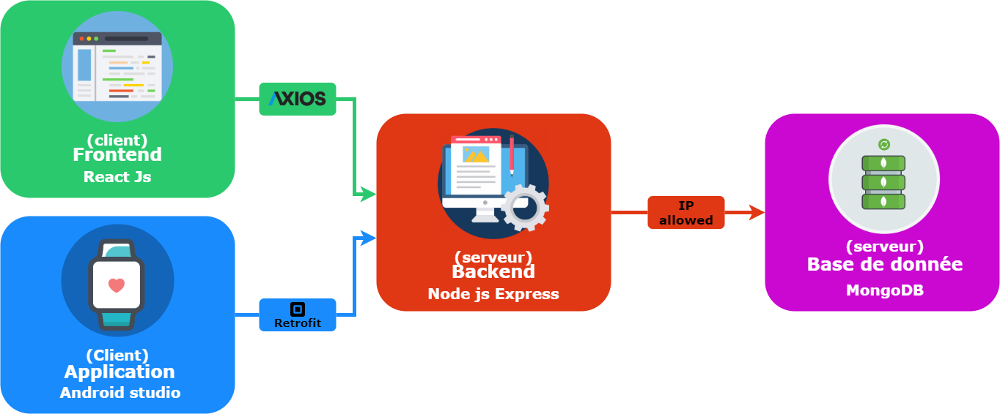

# Serveur Backend

Le serveur backend va servir de liaison entre les interfaces utilisateur(web/application) et la base de données.
C'est lui qui centralisera toutes les requêtes entrantes et sortantes

## Les requêtes 

Pour chaque collection dans la base de données, des requêtes suivant la norme CRUD (create, read, update, delete) lui sont associées 

## Collection User

voici toutes les requêtes qui sont effectuées pour la collection User, avec la Methode utilisé ainsi que la route utilisée.

### Create user

* Methode : post 
* Route : https://adresse/postUser
* Schema : 
    * firstname: { type: String, required: true },
    * lastname: { type: String, required: true },
    * address: { type: String, required: true },
    * age: { type: Number, min: 18, max: 100, required: true }

### get all users

* Methode : get
* Route : https://adresse/getUsers

### get user by id

* Methode : get
* Route : https://adresse/getUser/id

### update user by id

* Methode : put
* Route : https://adresse/putUser/id

### remove user

* Methode : delete
* Route : https://adresse/deleteUser/id

### Collection Data

voici toutes les requêtes qui sont effectuées pour la collection Data, avec la Methode utilisé ainsi que la route utilisée.

### Create data

* Methode : post 
* Route : https://adresse/postData
* Schema : 
    * userId: { type: Number, required: true } 
    * montreId: {type: Number, required: true}
    * activité: { type: String, required: true }
    * Accelero: { type: Array, required: true }

### get all data

* Methode : get
* Route : https://adresse/getDatas

### get data by id

* Methode : get
* Route : https://adresse/getData/id

### update data by id

* Methode : put
* Route : https://adresse/putData/id

### remove data

* Methode : delete
* Route : https://adresse/deleteData/id

## Installation

Avant de pouvoir lancer le serveur il faut dans un premier temps, s'assurer d'avoir installé toutes les dépendances nécessaires au serveur.

pour cela il faut faire la commande suivante : `npm i`

Une fois cela fait il est possible de lancer le serveur en local à l'adresse suivante http://localhost:8080 avec la commande suivante : `npm start`